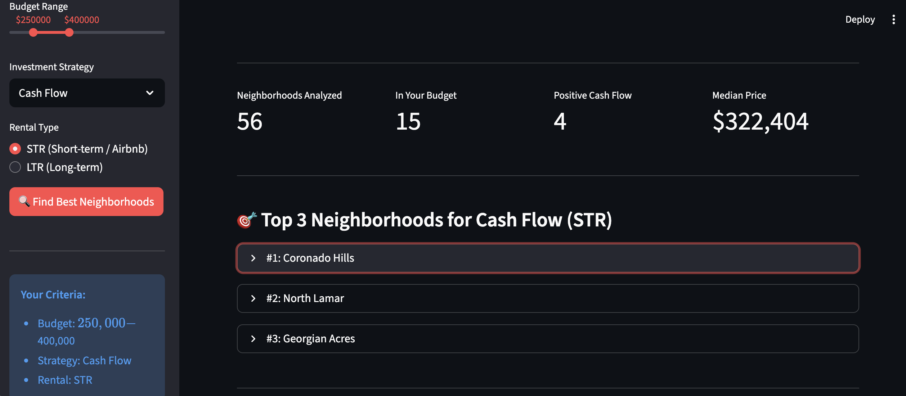
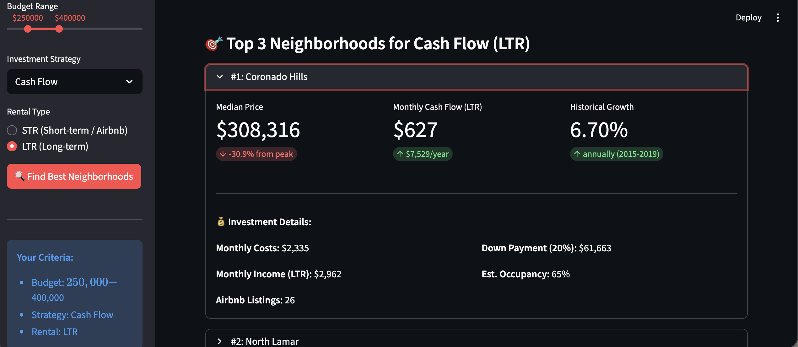
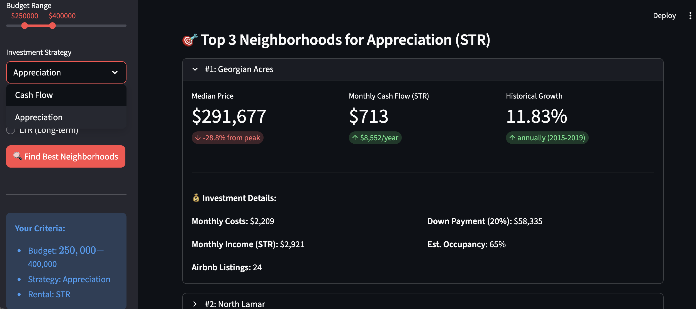

# 🏠 Austin Real Estate Investment Analyzer

**AI-powered tool that helps real estate investors identify the best neighborhoods in Austin based on cash flow potential and appreciation metrics.**

---

## 📋 Table of Contents

1. [Try It Now](#-try-it-now)
2. [The Problem](#-the-problem)
3. [What It Does](#-what-it-does)
4. [How It Works](#-how-it-works)
5. [Key Insights](#-key-insights-from-current-data)
6. [Example Visualizations](#-example-visualizations)
7. [App Screenshots](#-app-screenshots)
8. [What's Next](#-whats-next)
9. [Technical Stack](#️-technical-stack)
10. [Project Structure](#-project-structure)
11. [Background](#-background)
12. [Contact & Collaboration](#-contact--collaboration)
13. [License](#-license)

---

## 🚀 Try It Now

**No coding required to USE this tool** - just follow these simple steps:

### Quick Start (5 minutes)

1. **Clone the repository:**
```bash
   git clone https://github.com/cleburn/austin-investment-analyzer.git
   cd austin-investment-analyzer
```

2. **Install dependencies:**
```bash
   pip install streamlit pandas numpy
```

3. **Run the web app:**
```bash
   streamlit run app.py
```

4. **Use the tool:**
   - The app will open automatically in your browser at `http://localhost:8501`
   - Adjust your budget range, investment strategy, and rental type in the sidebar
   - Click "Find Best Neighborhoods" to see your top 3 recommendations

**Note:** Web deployment coming soon - this will allow you to access the tool via a simple link without any installation.

---

## 🎯 The Problem

Real estate investors spend hours manually comparing neighborhoods, calculating ROI, and searching for properties that match their investment strategy. The process is:
- **Time-consuming:** Dozens of neighborhoods to evaluate across multiple data sources
- **Complex:** Requires understanding of cash flow formulas, appreciation trends, and market cycles
- **Overwhelming:** Balancing budget constraints with investment goals (cash flow vs. long-term growth)

**This tool automates the entire research process and delivers ranked recommendations in seconds.**

---

## 💡 What It Does

The analyzer takes three inputs from you:
1. **Budget Range** (e.g., $250K - $400K)
2. **Investment Strategy** (Cash Flow or Appreciation)
3. **Rental Type** (Short-term rental (Airbnb) or Long-term rental)

Then it:
- Filters 185 Austin neighborhoods to match your budget
- Ranks them based on your chosen strategy
- Returns the **top 3 neighborhoods** with detailed metrics:
  - Expected monthly cash flow (STR and LTR)
  - Historical appreciation rates (2015-2019 baseline)
  - Current market position (distance from 2022 peak)
  - Confidence indicators (number of comparable listings)

---

## 🔍 How It Works

### Data Sources
The tool combines three public datasets to create a complete picture:

1. **Zillow Home Value Index (ZHVI)** — Neighborhood-level median home prices from 2000-2025
2. **Zillow Observed Rent Index (ZORI)** — Long-term rental rates by neighborhood
3. **Inside Airbnb** — 15,000+ short-term rental listings with occupancy and income data

### Analysis Engine
For each neighborhood, the tool calculates:

**Cash Flow Strategy Metrics:**
- Monthly short-term rental (STR) income: `nightly rate × 30 days × occupancy rate`
- Monthly long-term rental (LTR) estimate: `STR income ÷ 2.5` (industry standard)
- Monthly costs: Mortgage (20% down, 7% interest) + taxes (1.2%) + insurance (0.5%) + maintenance (1%)
- **Net cash flow:** `Income - Costs`

**Appreciation Strategy Metrics:**
- Pre-pandemic baseline growth rate (2015-2019 CAGR)
- Current recovery trajectory (2023-2025 CAGR)
- Distance from 2022 market peak (shows potential upside)

### Ranking System
Neighborhoods are ranked by the metric that matters most to your strategy:
- **Cash Flow investors:** Sorted by highest monthly profit
- **Appreciation investors:** Sorted by strongest historical growth

Only neighborhoods with **10+ Airbnb listings** are included (ensures reliable data).

---

## 📊 Key Insights from Current Data

**Austin Market Reality (as of October 2025):**
- **Cash Flow via STR is viable** — Top neighborhoods generate $400-$5,000/month positive cash flow
- **Cash Flow via LTR is difficult** — Most neighborhoods show negative cash flow at current interest rates (7%)
- **Appreciation opportunity exists** — Top growth neighborhoods are 25-35% below their 2022 peaks
- **Budget sweet spot:** $250K-$400K properties offer the best risk-adjusted returns

**Top Performers:**
- **Coronado Hills:** $308K, +$5,071/month STR cash flow (28.8% annual return on price)
- **North Lamar:** $292K, +$856/month STR cash flow + 11.4% historical appreciation
- **Georgian Acres:** $291K, +$713/month STR cash flow + 11.8% historical appreciation

---

## 📈 Example Visualizations

The tool generates comprehensive visualizations to help investors understand market trends:

### Austin Metro Price Trends (2000-2025)
Shows the complete price trajectory of the Austin metro area, highlighting:
- Pre-pandemic steady growth (2015-2019)
- COVID boom and 2022 peak
- Current market correction and stabilization

### Top 10 Neighborhoods - Cash Flow Comparison
Compares monthly cash flow potential across the highest-performing neighborhoods for both:
- Short-term rentals (STR/Airbnb)
- Long-term rentals (LTR)

### Top 10 Neighborhoods - Appreciation Potential
Ranks neighborhoods by historical growth rates (2015-2019 baseline CAGR), showing which areas have the strongest long-term appreciation track records.

**All charts are automatically saved to the `/visuals` folder when you run the analysis.**

---

## 📸 App Screenshots

### Home Page & Investment Criteria

*The analyzer's main interface - set your budget, strategy, and rental type to get instant recommendations*

### Cash Flow Strategy - Top 3 Neighborhoods (STR)

*Top 3 neighborhoods ranked by short-term rental (Airbnb) cash flow potential*

### Cash Flow Strategy - Long-Term Rentals

*Compare results when switching to long-term rental strategy - shows how recommendations adapt*

### Appreciation Strategy Results

*Switch to Appreciation strategy to see neighborhoods ranked by historical growth rates*

### Detailed Neighborhood Metrics

*Each recommended neighborhood includes comprehensive investment metrics: monthly cash flow, appreciation potential, occupancy rates, and confidence indicators*

### Market Analysis Visualizations

*Built-in visualizations compare cash flow potential across top-performing neighborhoods*

---

## 🚀 What's Next

### Current Version (MVP - Complete)
This proof-of-concept demonstrates the full analysis pipeline:
- ✅ Data ingestion and cleaning
- ✅ Neighborhood-level metrics calculation
- ✅ Strategy-based ranking system
- ✅ Interactive web interface (Streamlit)
- ✅ Data visualizations

### Roadmap (Future Phases)

**Phase 3:**
- Expand to Houston, Dallas, San Antonio
- Add financing scenario calculator (different down payments, interest rates)
- Include off-market deal sources (wholesalers, foreclosures)
- Property condition assessment (turnkey vs. rehab required)

**Phase 4:**
- Real-time MLS integration
- Automated listing alerts when new opportunities match criteria
- Portfolio optimization (suggest best mix of neighborhoods for diversification)
- Mobile-responsive design and cloud deployment

---

## 🛠️ Technical Stack

**Data Processing:**
- Python 3.11
- Pandas (data manipulation)
- NumPy (numerical calculations)

**Analysis:**
- Statistical modeling for cash flow projections
- Time-series analysis for appreciation trends

**Visualization:**
- Matplotlib & Seaborn (static charts)
- Streamlit (interactive web interface)

**Deployment:**
- Local deployment (current)
- Streamlit Cloud (planned)

---

## 📁 Project Structure
```
austin-investment-analyzer/
├── app.py                                # Streamlit web interface
├── notebooks/
│   └── texas-real-estate-analyzer.ipynb  # Main analysis notebook
├── data/
│   ├── raw/                              # Original datasets (not in Git)
│   └── processed/                        # Cleaned data (not in Git)
├── visuals/                              # Generated charts and graphs
│   ├── austin_metro_price_trends.png
│   ├── top_neighborhoods_cashflow.png
│   └── top_neighborhoods_appreciation.png
├── .gitignore
└── README.md
```

---

## 🎓 Background

This project is part of a 9-month AI Engineer roadmap focused on building practical, income-generating tools at the intersection of real estate investment and data science.

**Why Austin?**
- Strong market fundamentals (top 10 US metro for growth)
- Rich public data availability
- High short-term rental demand (tourism + business travel)
- Personal expertise: 5+ years managing investment properties in Texas

**Methodology:**
The analysis approach prioritizes **conservative assumptions** over optimistic projections:
- 7% mortgage rates (current market reality, not historical lows)
- Full operating expense modeling (taxes, insurance, maintenance, vacancies)
- Real occupancy data (not theoretical maximums)
- Pre-pandemic growth baselines (excludes 2020-2022 anomaly spike)

This ensures recommendations remain viable even in less-than-ideal market conditions.

---

## 📬 Contact & Collaboration

**Cleburn Walker**  
📧 [cleburn.walker@gmail.com](mailto:cleburn.walker@gmail.com)  
💼 [LinkedIn](https://linkedin.com/in/cleburnwalker)  
💻 [GitHub](https://github.com/cleburn)

### For Investors & Partners:
Interested in scaling this tool to additional markets or exploring commercial partnerships? Let's connect. This MVP demonstrates the potential for a full-featured platform serving real estate investors nationwide.

### For Developers:
Feedback, contributions, and collaboration welcome. This is an active learning project and I'm open to suggestions for improvement or new features.

---

## 📄 License

This project is open source and available for educational and personal use. Data sources retain their original licensing terms.

---

**Last Updated:** October 23, 2025  
**Status:** Phase 2 Complete — MVP with web interface deployed locally